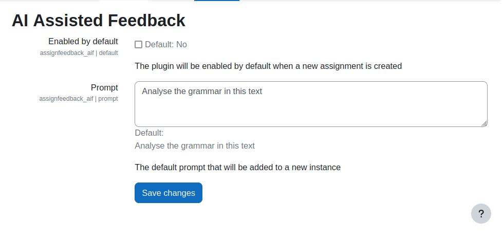

# AI Assisted Feedback (assignfeedback_aif)

[](https://moodle.org)
[](https://php.net)
[](https://www.gnu.org/copyleft/gpl.html)
[]()

An assignment feedback plugin for Moodle that leverages AI/LLM systems to automatically generate
constructive feedback on student submissions. The plugin integrates seamlessly into Moodle's
assignment grading workflow, supporting both manual batch operations and automatic feedback
generation on submission.

## Features

- **AI-Powered Feedback Generation** — Automatically generate detailed feedback using configurable
  AI backends (Moodle Core AI Subsystem or local_ai_manager).
- **Rubric Integration** — When rubric grading is configured, rubric criteria are automatically
  included in the AI prompt for context-aware feedback.
- **Multiple Submission Types** — Supports online text submissions, file submissions (with text
  extraction), and image analysis (PNG, JPEG, WebP, GIF).
- **Auto-Generate on Submission** — Optionally generate AI feedback automatically when a student
  submits their assignment (configurable per assignment).
- **Batch Operations** — Generate or delete AI feedback for multiple students at once from the
  grading table.
- **Regenerate Button** — Teachers can regenerate feedback for individual students directly from
  the grading form via AJAX.
- **Configurable Prompt Template** — Structured prompt template with placeholders for submission
  text, rubric criteria, teacher instructions, assignment name, and language.
- **AI Disclaimer** — Configurable disclaimer appended to every AI-generated feedback, with
  optional automatic translation to the student's language.
- **Dual AI Backend Support** — Choose between Moodle's built-in Core AI Subsystem (4.5+) or
  the local_ai_manager plugin for advanced features like usage quotas and role-based configuration.
- **GDPR Compliant** — Full Privacy API implementation for data export and deletion.
- **Editable Feedback** — Teachers can review and edit AI-generated feedback before releasing
  it to students.

## Requirements

- **Moodle** 4.5 or later (for Core AI Subsystem support)
- **PHP** 8.2 or later
- At least one AI provider configured:
  - **Core AI Subsystem**: Configure an AI provider in *Site Administration → AI → AI providers*
  - **local_ai_manager** (optional): Install and configure the
    [local_ai_manager](https://moodle.org/plugins/local_ai_manager) plugin
- For file submission analysis: A document converter plugin (e.g., Google Drive converter)

## Installation

### Via Git

```bash
cd /path/to/moodle/mod/assign/feedback
git clone https://github.com/marcusgreen/moodle-assignfeedback_aif.git aif
```

### Via Download

1. Download the latest release from the
   [Moodle Plugin Directory](https://moodle.org/plugins/assignfeedback_aif) or
   [GitHub Releases](https://github.com/marcusgreen/moodle-assignfeedback_aif/releases).
2. Extract to `mod/assign/feedback/aif/`.
3. Visit *Site Administration → Notifications* to complete the installation.

### Via Moodle Plugin Directory

1. Go to *Site Administration → Plugins → Install plugins*.
2. Search for "AI Assisted Feedback".
3. Click *Install*.

## Configuration

### Site Administration

Navigate to *Site Administration → Plugins → Activity modules → Assignment → Feedback plugins
→ AI Assisted Feedback*.

| Setting | Description | Default |
|---------|-------------|---------|
| **Enabled by default** | Enable the plugin by default for new assignments | No |
| **Prompt** | Default prompt for new assignment instances | "Analyse the grammar in this text" |
| **AI backend** | Choose between Core AI Subsystem or local_ai_manager | Core AI Subsystem |
| **AI purpose** | Purpose identifier for local_ai_manager | `feedback` |
| **Prompt template** | Structured template with placeholders | (see [Prompt Template System](docs/prompt-template-system.md)) |
| **Disclaimer** | Text appended to AI responses | "(This feedback was generated by an AI system...)" |
| **Translate disclaimer** | Auto-translate disclaimer to user's language | Yes |

### Assignment-Level Configuration

When editing an assignment:

1. Under *Feedback types*, enable **AI Assisted Feedback**.
2. Enter a **Prompt** specific to this assignment (e.g., "Analyse grammar and content quality").
3. Optionally enable **Generate feedback automatically on submission**.


## Usage

### Automatic Feedback Generation

1. Enable "Generate feedback automatically on submission" in assignment settings.
2. Students submit their assignments.
3. An ad-hoc task is queued and processed by cron.
4. AI feedback appears in the grading interface once the task completes.

### Batch Feedback Generation

1. Navigate to the assignment's *View all submissions* page.
2. Select one or more students using the checkboxes.
3. From the "With selected..." dropdown, choose **Generate AI feedback** or **Delete AI feedback**.
4. Confirm the action.
5. Wait for cron to process the queued tasks.


### Regenerate Feedback

On the single-student grading form, click the **Regenerate AI feedback** button to queue
a new feedback generation for that student.

### Editing Feedback

AI-generated feedback is displayed in an editor field. Teachers can freely edit the text
before saving the grade.

## AI Backends

The plugin supports two AI backends:

| Feature | Core AI Subsystem | local_ai_manager |
|---------|-------------------|------------------|
| **Moodle Version** | 4.5+ (built-in) | Any (separate plugin) |
| **Setup** | Configure provider in Site Admin | Install + configure plugin |
| **Usage Quotas** | No | Yes (per user/role) |
| **Purpose-based Config** | No | Yes |
| **Role-based Access** | No | Yes |

See [AI Backends Documentation](docs/ai-backends.md) for detailed setup instructions.

## Plugin Settings



## Testing

### PHPUnit

```bash
vendor/bin/phpunit --filter assignfeedback_aif
```

### Behat

```bash
vendor/bin/behat --tags=@assignfeedback_aif
```

See [Development Guide](docs/development.md) for detailed testing instructions.

## Documentation

Comprehensive documentation is available in the [docs/](docs/) directory:

- [Architecture Overview](docs/architecture.md) — Technical architecture, class structure,
  data flow
- [Admin Configuration](docs/admin-configuration.md) — Detailed admin settings guide
- [Teacher Guide](docs/teacher-guide.md) — How to use the plugin as a teacher
- [Prompt Template System](docs/prompt-template-system.md) — Template customization, placeholders,
  examples
- [AI Backends](docs/ai-backends.md) — Backend comparison and setup
- [Task System](docs/task-system.md) — Background processing, scheduled and ad-hoc tasks
- [API Reference](docs/api-reference.md) — External API, events, caching, privacy
- [Development Guide](docs/development.md) — Contributing, testing, coding standards

## Privacy / GDPR

This plugin stores AI-generated feedback text per student submission. The plugin implements
Moodle's Privacy API (`\core_privacy\local\metadata\provider`) and supports:

- **Data export**: AI feedback is included in user data exports.
- **Data deletion**: AI feedback is deleted when user data is purged.
- **Context deletion**: All feedback is removed when an assignment is deleted.

No personal data is sent to the AI provider beyond the submission content and prompt.

## Credits

- **Original Author**: [Marcus Green](https://github.com/marcusgreen)
- **Contributors**: Sumaiya Javed (Catalyst), Thom Rawson (inspiration and support)
- **License**: [GNU GPL v3 or later](https://www.gnu.org/copyleft/gpl.html)

## Links

- [GitHub Repository](https://github.com/marcusgreen/moodle-assignfeedback_aif)
- [GitHub Wiki](https://github.com/marcusgreen/moodle-assignfeedback_aif/wiki)
- [Issue Tracker](https://github.com/marcusgreen/moodle-assignfeedback_aif/issues)
- [Moodle Plugin Directory](https://moodle.org/plugins/assignfeedback_aif)
