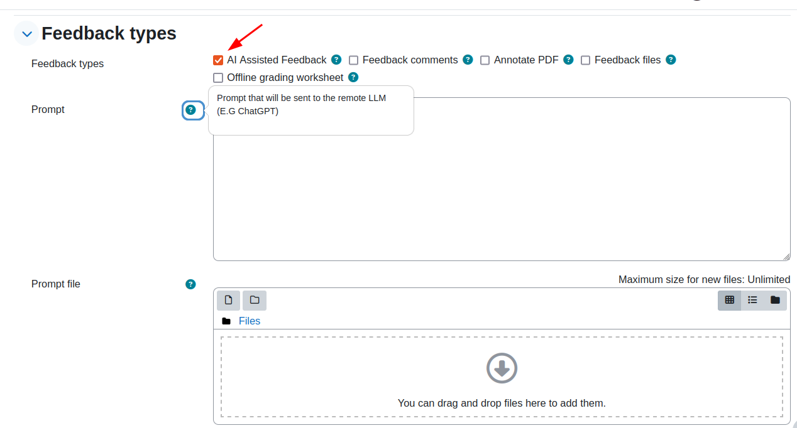
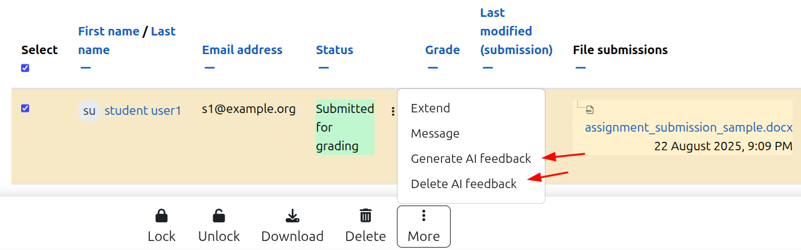

# Teacher Guide

This guide explains how teachers use the AI Assisted Feedback plugin within assignments.

## Enabling the Plugin for an Assignment

1. Navigate to your course and click **Turn editing on**.
2. Create a new assignment or edit an existing one.
3. Scroll to the **Feedback types** section.
4. Check **AI Assisted Feedback**.

When enabled, three additional settings appear:

| Setting | Description |
|---------|-------------|
| **Prompt** | Your instructions to the AI for this specific assignment |
| **Generate feedback automatically on submission** | Auto-generate when students submit |
| **Prompt file** | (Future feature) Upload prompt as a text file |



## Writing an Effective Prompt

The **Prompt** field is where you tell the AI what kind of feedback to generate. This prompt
is combined with a site-wide prompt template (configured by the administrator) and sent to
the AI along with the student's submission.

### Good Prompt Examples

**For an essay assignment:**
```
Evaluate this essay for:
1. Thesis clarity and argument strength
2. Evidence quality and use of sources
3. Writing structure and paragraph organisation
4. Grammar and academic tone
Provide specific suggestions for improvement.
```

**For a programming assignment:**
```
Review this code for:
- Correctness and logic errors
- Code style and readability
- Use of appropriate data structures
- Error handling
Suggest specific improvements with examples.
```

**For a lab report:**
```
Assess this lab report for scientific rigour:
- Hypothesis clarity
- Methodology description
- Data presentation and analysis
- Conclusion validity
Focus on constructive feedback to improve scientific writing skills.
```

### Tips for Prompts

- **Be specific** — Generic prompts produce generic feedback. Tell the AI exactly what to focus on.
- **Match your rubric** — If you have a rubric configured, the AI will see it automatically. Your
  prompt should complement it, not repeat it.
- **Set the tone** — Tell the AI to be "encouraging", "constructive", or "detailed".
- **Specify the audience** — "This is a first-year undergraduate" gives context for appropriate
  feedback level.

## Auto-Generate on Submission

When **Generate feedback automatically on submission** is checked:

1. A student submits their assignment.
2. A background task is automatically queued.
3. Moodle's cron processes the task (usually within 1–2 minutes).
4. AI feedback appears in the grading interface.

> **Note:** The feedback is generated in the background. There may be a short delay (typically
> 1–5 minutes depending on cron frequency and AI response time) before the feedback is visible.

### When to Use Auto-Generate

- ✅ Formative assignments where quick feedback is valuable
- ✅ Large classes where manual feedback is time-consuming
- ✅ Draft submissions where students benefit from immediate guidance

### When to Avoid Auto-Generate

- ❌ Summative exams where AI feedback could influence other submissions
- ❌ When AI costs are a concern and not all submissions need feedback
- ❌ Assignments where human-only feedback is pedagogically important

## Practice Mode (Student Self-Feedback)

Practice mode allows students to see AI-generated feedback **immediately** after submitting,
without waiting for teacher review. This is ideal for formative exercises where students
should be able to practise and improve independently.

### How It Works

Practice mode is **not a separate toggle** — it results from combining two standard Moodle
settings:

| Setting | Value | Effect |
|---------|-------|--------|
| **Generate feedback automatically** | ✅ Enabled | AI feedback is generated on submission |
| **Marking workflow** (Assignment → Grade) | ❌ Disabled | No teacher release step required |

When both conditions are met:

1. Student submits their assignment.
2. Background task generates AI feedback (1–5 minutes).
3. A grade record is automatically created (grade = not yet set).
4. **Student can see the AI feedback immediately** on their submission page.
5. A **practice disclaimer** is shown instead of the regular one.

### Setting Up Practice Mode

1. Edit assignment → **Feedback types** → enable **AI Assisted Feedback**.
2. Write a prompt appropriate for self-study feedback.
3. Check **Generate feedback automatically on submission**.
4. Under **Grade** → set **Marking workflow** to **No**.
5. Save.

> **That's it.** The combination of autogenerate + no marking workflow activates practice mode
> automatically.

### Setting Up Teacher-Reviewed Mode

For assignments where the teacher should review the AI feedback before students see it:

1. Same setup as above, but set **Marking workflow** to **Yes**.
2. AI feedback is generated automatically but **hidden from students**.
3. Teacher reviews and edits the feedback in the grading interface.
4. Teacher sets marking workflow state to **Released**.
5. Only then does the student see the feedback.

### Practice Mode vs Teacher-Reviewed Comparison

| Aspect | Practice Mode | Teacher-Reviewed |
|--------|--------------|------------------|
| Marking workflow | Off | On |
| Student sees feedback | Immediately after generation | After teacher releases |
| Teacher reviews first | No | Yes |
| Disclaimer | *"NOT been reviewed by a teacher"* | *"reviewed by your teacher"* |
| Best for | Formative exercises, self-study | Summative, quality-critical |

### Testing Practice Mode

To verify practice mode works correctly in your environment:

1. **Create a test assignment:**
   - Create a new assignment in a test course.
   - Enable **AI Assisted Feedback** with a simple prompt (e.g., "Give brief feedback").
   - Check **Generate feedback automatically on submission**.
   - Set **Marking workflow** to **No**.
   - Set **Submission types** to **Online text** (simplest to test).
   - Save.

2. **Submit as a test student:**
   - Log in as a test student (or use "Log in as" from a student profile).
   - Open the assignment and submit some text.
   - You should see a confirmation that the submission was received.

3. **Run cron:**
   - In your development environment, run: `bindev/cron.sh`
   - Or wait for the scheduled cron (production: typically every minute).
   - Look for the message: *"AI feedback generated for assignment..."*

4. **Verify student sees feedback:**
   - As the test student, reload the assignment page.
   - The AI feedback should be visible in the submission status area.
   - Verify the **practice disclaimer** is shown:
     *"This feedback was generated by an AI system for self-study purposes.
     It has NOT been reviewed or approved by a teacher..."*

5. **Verify teacher-reviewed mode (contrast test):**
   - Edit the assignment and set **Marking workflow** to **Yes**.
   - Submit again as a student, run cron.
   - The student should **not** see the new feedback.
   - As teacher, go to grading → verify the feedback is visible to you.
   - Set workflow state to **Released** → now the student sees it.
   - Verify the **regular disclaimer**: *"reviewed by your teacher"*.

---

## Batch Operations

For assignments where auto-generate is not enabled, you can generate feedback for multiple
students at once.

### Generate AI Feedback (Batch)

1. Navigate to the assignment and click **View all submissions**.
2. Use the checkboxes to select the students you want to generate feedback for.
3. From the **With selected...** dropdown at the bottom, choose **Generate AI feedback**.
4. Confirm the action in the dialog.
5. A notification will indicate the task has been queued.
6. Wait for cron to process the tasks.



### Delete AI Feedback (Batch)

To remove AI-generated feedback for selected students:

1. Select students using the checkboxes.
2. Choose **Delete AI feedback** from the dropdown.
3. Confirm the deletion.

> **Tip:** You can select all students using the checkbox in the table header.

## Viewing AI Feedback

### In the Grading Table

The AI feedback appears as a column in the grading table view. A summary of the feedback
text is shown.

### In the Single Student Grading Form

When grading an individual student:

1. The AI-generated feedback appears in the **AI Assisted Feedback** editor field.
2. The text is fully editable — you can modify, add to, or replace the AI feedback.
3. Below the editor, a **Regenerate AI feedback** button allows you to request new feedback.

## Regenerating Feedback

If the AI feedback is not satisfactory or you've changed the prompt:

1. Open the single student grading form.
2. Click the **Regenerate AI feedback** button.
3. A notification confirms the regeneration task has been queued.
4. Reload the page after cron has run to see the new feedback.

> **Important:** Regenerating replaces the existing AI feedback. Any manual edits to the
> previous feedback will be lost when the new feedback is generated.

## Editing and Saving Feedback

The AI-generated feedback is always placed in an editor field, allowing full control:

1. **Review** the AI feedback carefully.
2. **Edit** as needed — fix inaccuracies, add personal comments, adjust tone.
3. **Save** the grade and feedback using the normal Moodle grading workflow.

The saved feedback (including your edits) is what the student will see.

## Rubric Integration

If your assignment uses a **Rubric** as the grading method:

1. The rubric criteria and level definitions are automatically extracted.
2. They are included in the AI prompt under the `{{rubric}}` placeholder.
3. The AI can reference specific rubric criteria when generating feedback.

**Example of what the AI sees:**

```
=== GRADING CRITERIA ===
- Content Quality: Inadequate | Basic | Good | Excellent
- Research Depth: No sources | Few sources | Adequate sources | Extensive sources
- Writing Style: Poor | Acceptable | Good | Outstanding
```

This means the AI can say things like: "Your content quality is at a 'Good' level because..."

> **Note:** The rubric is only included if the assignment's grading method is set to "Rubric"
> in the assignment settings under *Grade → Grading method*.

## File Submissions

The plugin can analyse file submissions in addition to online text:

### Text Files

Text is automatically extracted from submitted files. Supported formats depend on the
configured document converter:

- Plain text (`.txt`) — always supported
- PDF — requires a document converter (e.g., Google Drive)
- DOCX, ODT, etc. — depends on converter capabilities

### Image Files

The plugin supports visual analysis of image submissions:

- Supported formats: PNG, JPEG, WebP, GIF
- The first image in the submission is sent to the AI for analysis.
- The AI can describe and provide feedback on visual content.

> **Requirement:** Image analysis requires an AI provider that supports vision/image input.

## Understanding the Disclaimer

Every AI-generated feedback includes a disclaimer at the bottom (configured by your site
administrator). This typically reads:

> *(This feedback was generated by an AI system and reviewed by your teacher.)*

The disclaimer:
- Is automatically appended to each feedback.
- May be translated to the student's language if the admin has enabled translation.
- Cannot be removed by teachers (it is re-added on regeneration).
- Can be edited away manually if the teacher edits the feedback text before saving.

## Frequently Asked Questions

### Q: How long does it take to generate feedback?

Feedback is generated by background tasks. The typical delay is 1–5 minutes, depending on:
- Cron frequency (ideally every minute)
- AI provider response time
- Number of submissions being processed simultaneously

### Q: Can students see the AI feedback immediately?

**It depends on the assignment configuration:**

- **Practice mode** (autogenerate ON + marking workflow OFF): Yes, students see feedback
  as soon as the background task completes (typically 1–5 minutes).
- **Teacher-reviewed mode** (autogenerate ON + marking workflow ON): No, students see
  feedback only after the teacher releases the grade.
- **Manual generation** (autogenerate OFF): Same as teacher-reviewed — follows the normal
  Moodle assignment workflow.

See [Practice Mode](#practice-mode-student-self-feedback) for details.

### Q: What happens if the AI fails to generate feedback?

If an error occurs, the task logs an error message. No feedback record is created. You can:
- Check the task logs (*Site Administration → Server → Task logs*)
- Try regenerating the feedback
- Use batch operations to regenerate for affected students

### Q: Can I use the plugin without a rubric?

Yes. The rubric is optional. Without a rubric, the AI generates feedback based solely on the
submission text and your prompt.

### Q: Does the AI remember previous submissions?

No. Each feedback generation is independent. The AI only sees the current submission, the
prompt, and (if configured) the rubric criteria.
